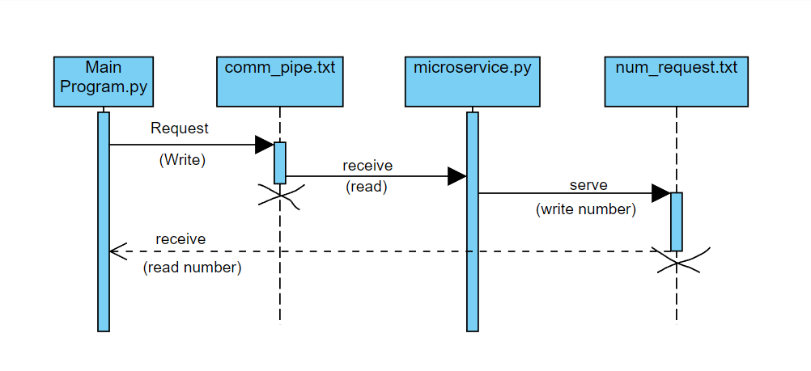
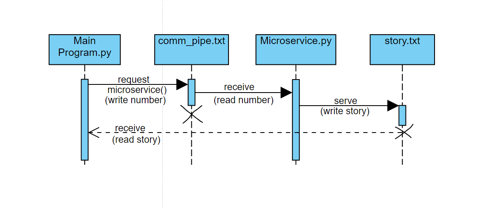

# Mad-Libs @ CLI
Jeremy Talbert - CS361 Project

# Microservice Program for Bruce Curtis (the one I made him)
This microservice will wait for the word "run" to be written into the text file "comm_pipe.txt". Once "run" is put into
the text file, it will then "connect" to your program and write a randomly generated number between the values 10,000
and 100,000 into the file "num_request.txt" which your program can then read from. Right now, the program is running
in a loop, so as long as "run" is in the comm_pipe.txt, it will continue generating a random number every 10 seconds.
We can change this to only serve a static number depending on the needs of your program. 

# UML Sequence Diagram (for Bruce's Microservice)

# Microservice implementation by Bruce Curtis (the one he made me)
My program will request data from the microservice Bruce implemented by writing a request to a 
file called "comm_pipe.txt". My program will write a specific number to comm_pipe.txt that will tell 
the microservice which Mad-Lib it needs to serve my program.The Microservice will then write the required information 
into a text file called "story.txt". My program will then read the data within story.txt and implement it into a class 
that it can then use to process new Mad-Lib stories for users to play with.

# UML Sequence Diagram (for my program)
